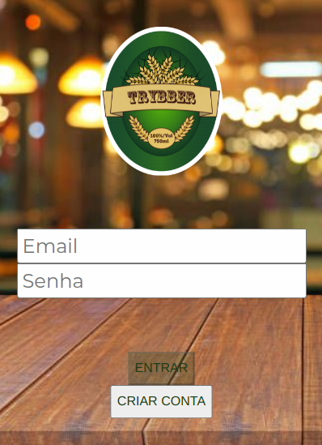
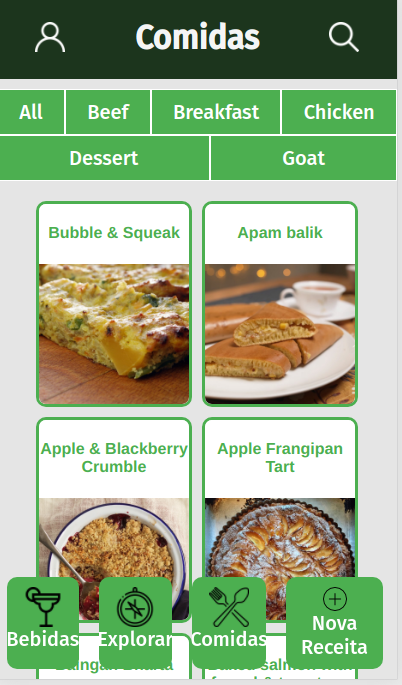

<!-- **TESTING TO ADD A GITHUB PROFILE**   -->

<h1>Ricardo Rosa</h1>

<h2>Sobre mim</h2>

:computer: Acabo de finalizar a formação de desenvolvedor FullStack na <a href="https://github.com/betrybe">@betrybe</a>. Você pode ver mais sobre a Trybe e os projetos que desenvolvi no curso no repositório <a href="https://github.com/ricardorosa-dev/Curso-Trybe">Curso Trybe</a>.

:balloon: Minhas paixões (além de codar) são o desenvolvimento pessoal (que eu estudo há mais de 15 anos!) e a música (sou formado em Composição e Regência :violin:).

<h2>:beginner: Tecnologias que eu utilizo</h2>
<h3>FrontEnd</h3>

  
  
  
  
  
  

  
  <h3>BackEnd</h3>
  
  
  
  

  
  
  <h3>Aprendendo...</h3>
  

<!--  -->
  
<!--
  <h3>Próximos da lista:</h3>
  
  
   
  
  
  

-->

<h2>Formação</h2>
Curso de Desenvolvimento Web FullStack na @betrybe  
Jun 2020 - Jul 2021  
 

<h2>Projetos de interesse</h2>

<h3><a href="https://github.com/ricardorosa-dev/33-Trybeer-v2">Trybeer</a>: App FullStack de Entrega de Bebidas, com FrontEnd em React utilizando ContextAPI para compartilhamento de estado e BackEnd em Node, utilizando dois bancos de dados, em MySQL e MongoDB, e a biblioteca Socket.io para Chat em tempo real.</h3>

<h3><a href="https://github.com/ricardorosa-dev/sd-06-project-recipes-app">Recipes App</a>: App de receitas: FrontEnd em React e consumo de APIs</h3>  

---
<h2> Links:</h2>
<h3>Portifolio: <a href="http://ricardorosa-dev.github.io">http://ricardorosa-dev.github.io</a></h3>
<h3>LinkedIn: <a href="https://www.linkedin.com/in/ricardorosa-dev">https://www.linkedin.com/in/ricardorosa-dev</a></h3>
